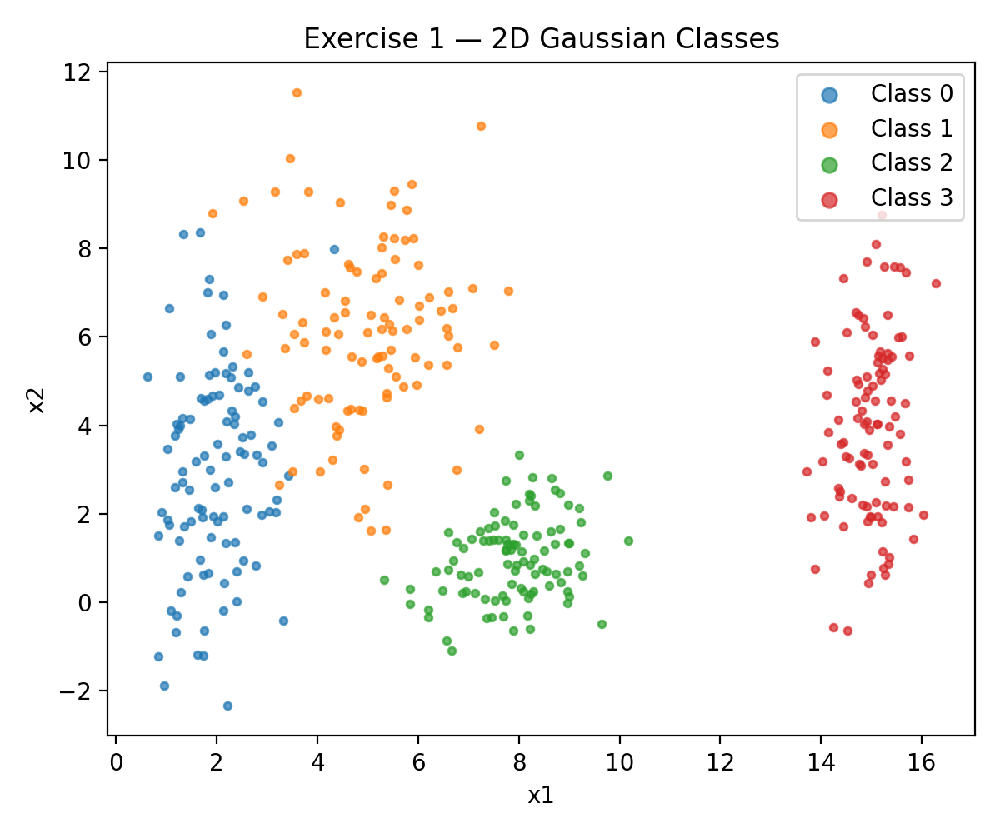
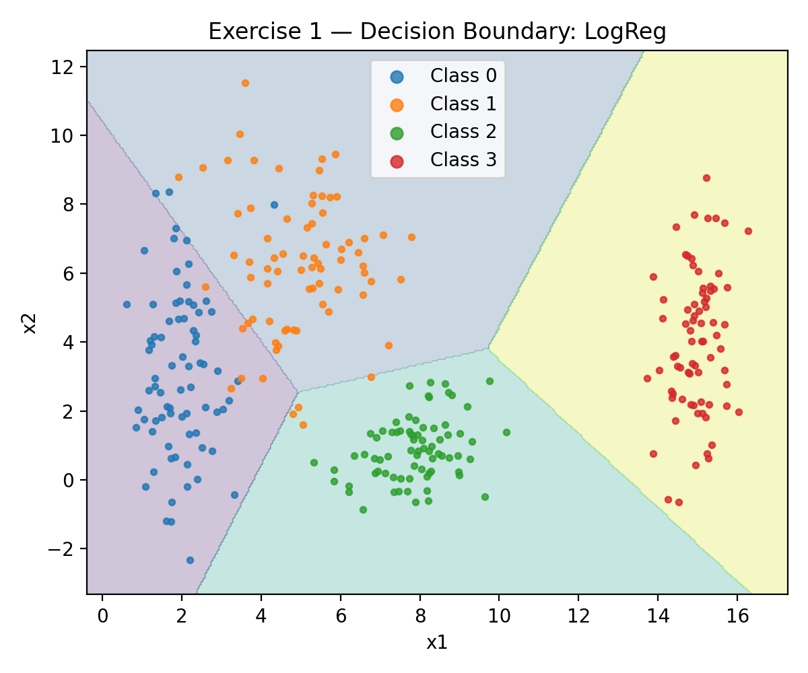
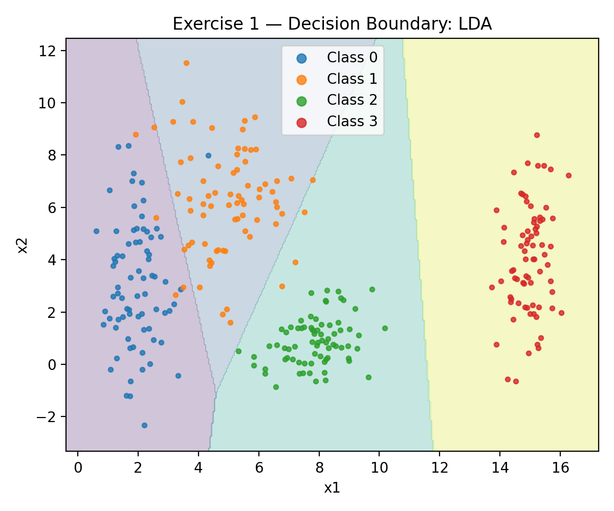
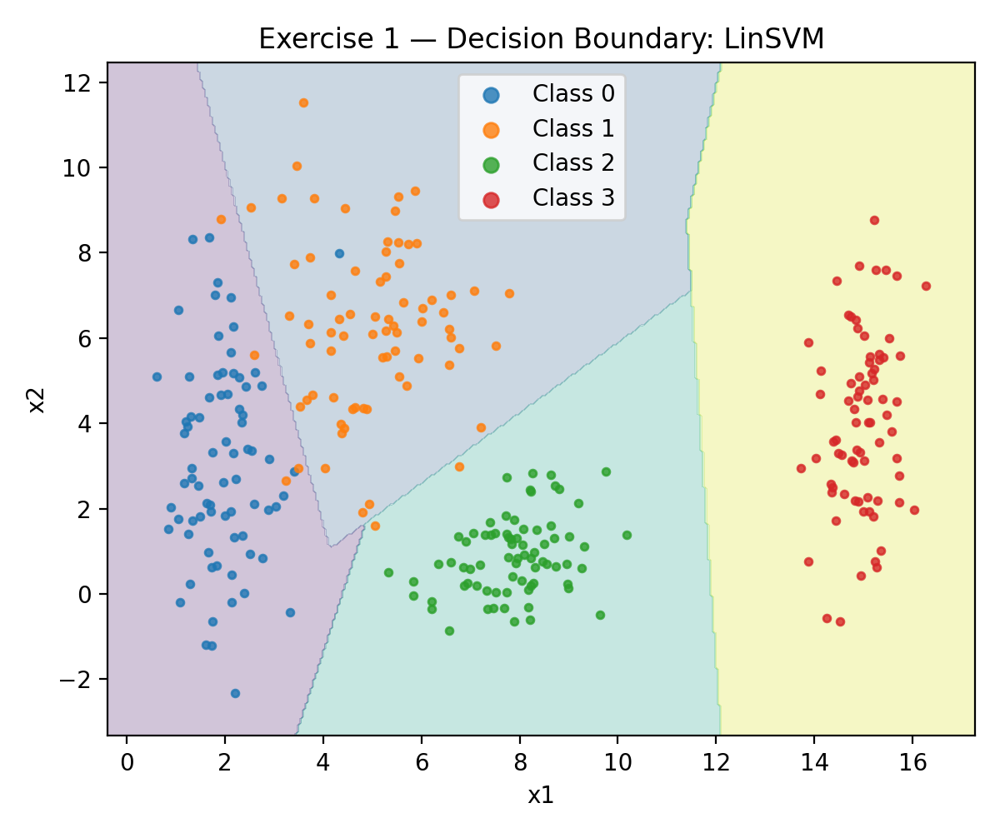
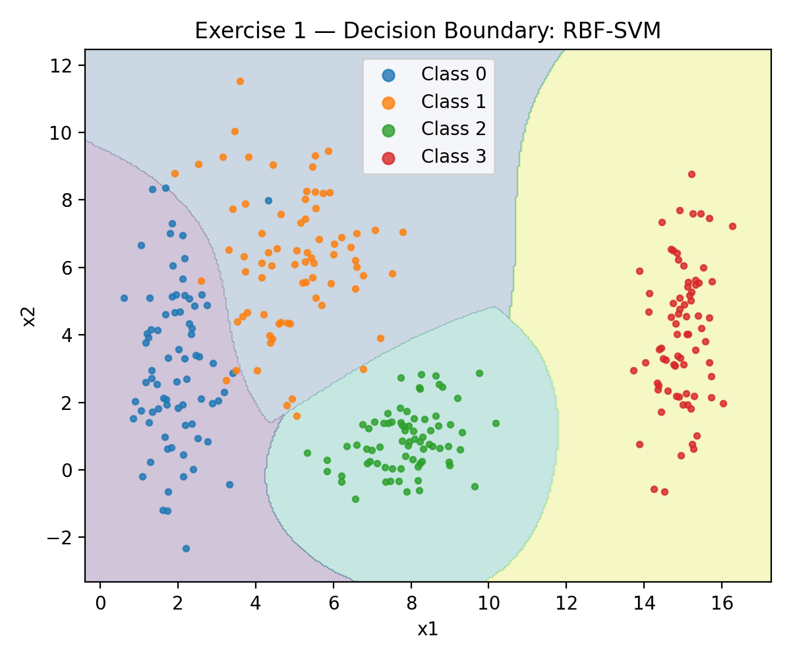
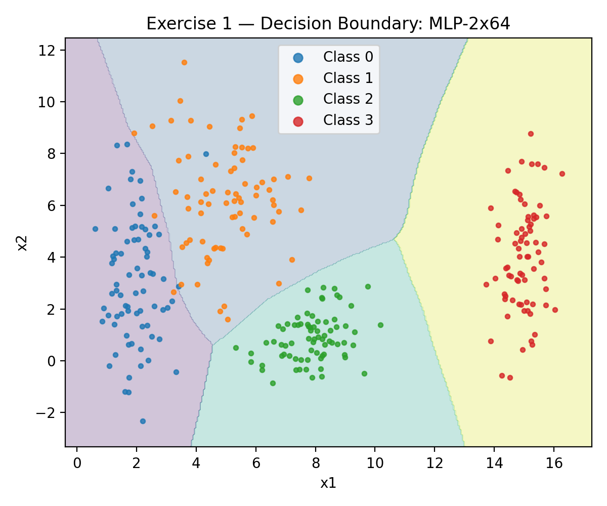
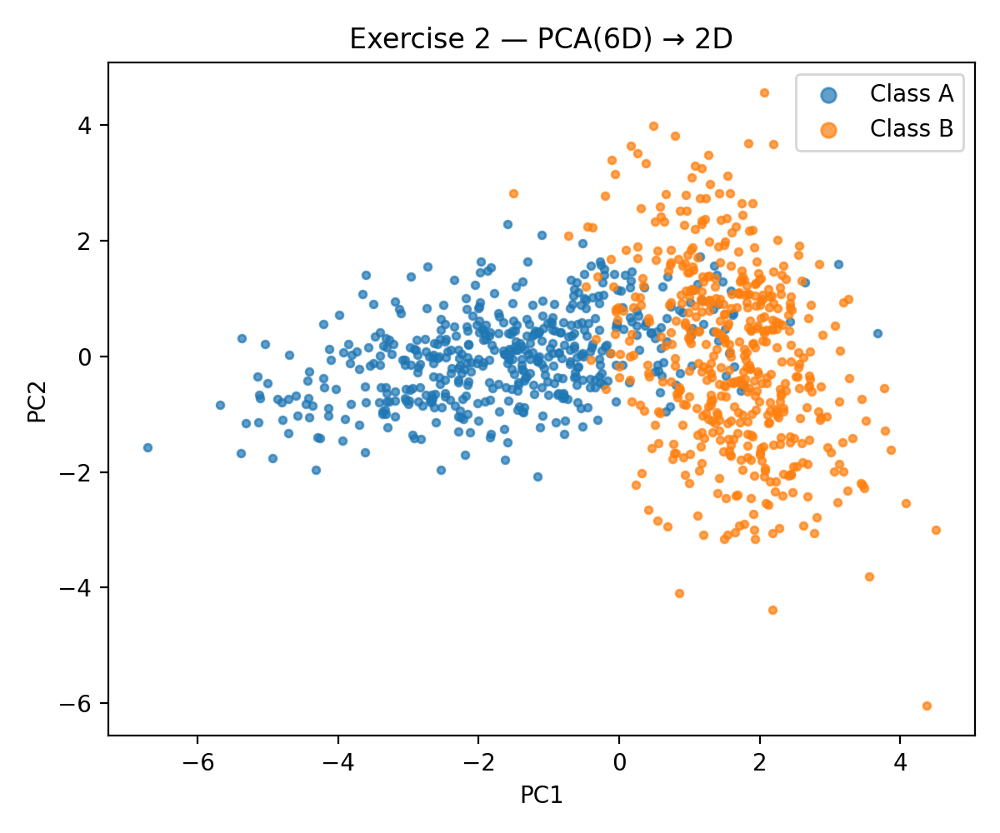
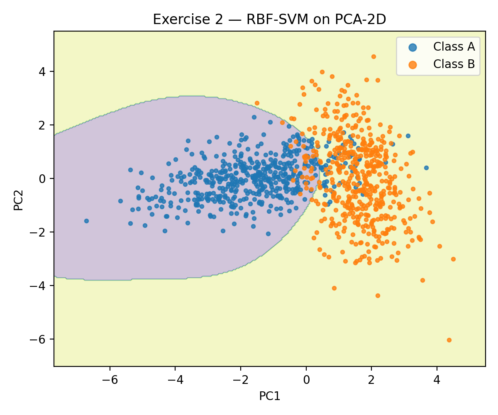
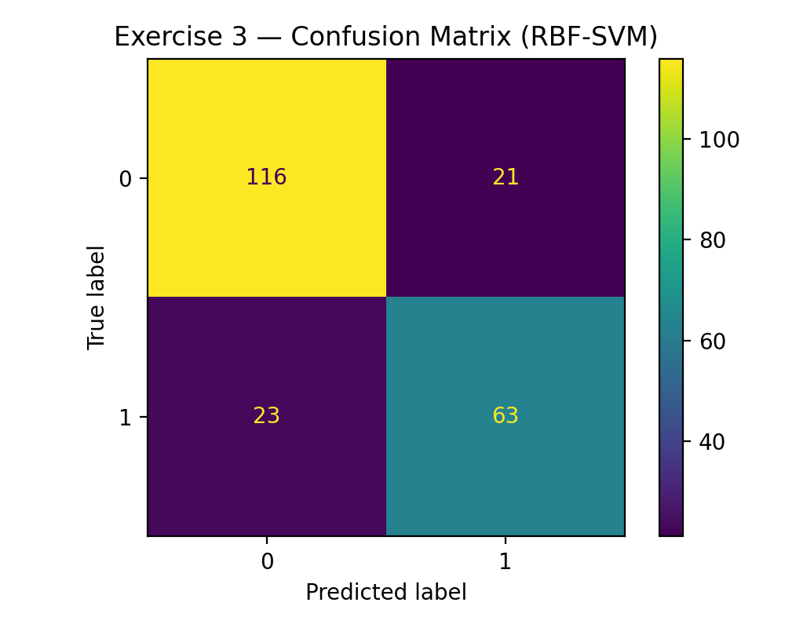
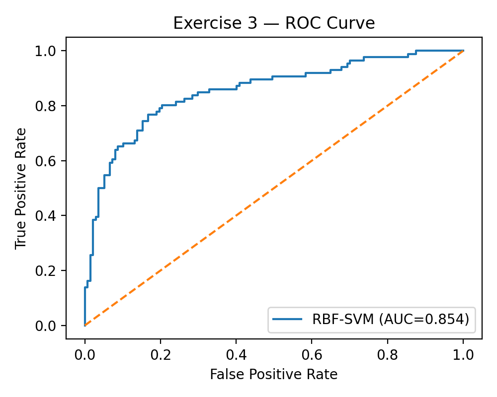

# Data

This report summarizes the work done in **Exercises 1, 2, and 3** of the Data Preparation and Analysis for Neural Networks activity.  
All generated figures are stored in the `./images` folder.  
Each section below explains what we did, shows the figures, and provides brief interpretations.

---

## Exercise 1 — Class Separability in 2D

### Goal
We created a synthetic 2D dataset with **four Gaussian-distributed classes**. The purpose was to investigate class separability and compare linear versus non-linear decision boundaries.

### Data distribution
The scatter plot shows how the four Gaussian classes overlap and spread in the 2D feature space.

### Decision boundaries
We trained multiple classifiers and visualized their boundaries:

- **Logistic Regression** — A linear classifier. The boundary is straight lines, which may not fully separate overlapping regions.  

- **LDA** — Also linear, assumes Gaussian distributions with shared covariance. Works well if assumptions hold.  

- **Linear SVM** — Maximizes margins but restricted to linear separation.  

- **RBF-SVM** — Uses a radial basis kernel to capture **non-linear** regions, fitting more complex shapes.  

- **MLP (2 hidden layers)** — A neural network that can approximate complex non-linear decision regions.  

### Key observations
- Linear models (LogReg, LDA, Linear SVM) produce straight boundaries, which may leave misclassified regions.  
- Non-linear models (RBF-SVM, MLP) adapt to the curved boundaries and usually achieve higher accuracy.  
- This exercise demonstrates why neural networks are powerful for non-linear class separation.

---

## Exercise 2 — Non-linearity in Higher Dimensions

### Goal
We generated two classes in **6 dimensions** using different means and covariance structures. We reduced the data to 2D with **PCA** to visualize separability, then compared linear and non-linear models in both 6D and PCA-2D spaces.

### PCA projection
The PCA scatter plot shows the two classes after dimensionality reduction. While there is some separation, the overlap indicates the problem is not linearly separable in 2D.  

### Decision boundary (non-linear model)
We trained an **RBF-SVM** on the PCA-reduced space. The figure shows how the kernel-based classifier creates non-linear boundaries.  

### Key observations
- In the full **6D space**, non-linear models achieve higher performance than linear ones, as expected.  
- PCA helps visualize structure but loses information — some linear separability is hidden in higher dimensions.  
- Neural networks and kernel methods (like RBF-SVM) are better suited for this type of complex data.

---

## Exercise 3 — Titanic Dataset (Real-World Preprocessing & Classification)

### Goal
We prepared and modeled the **Titanic dataset** (or a synthetic version if the real one is not present). The objective was to practice data preprocessing and classification pipeline design.

### Preprocessing steps
- **Missing values**: filled numeric features with median, categorical with the most frequent value.  
- **Encoding**: one-hot encoding for categorical variables.  
- **Scaling**: standardized numeric features.  
- **Target**: `Survived` column (binary classification).

### Confusion Matrix
The confusion matrix for the best-performing model shows correct vs. incorrect predictions for survivors and non-survivors.  

### ROC Curve
The ROC curve illustrates the trade-off between true positives and false positives, with the AUC score summarizing classifier performance.  

### Key observations
- Non-linear models (Random Forest, MLP, RBF-SVM) typically outperform simple Logistic Regression on this dataset.  
- The ROC curve and AUC are particularly useful because class imbalance exists in Titanic (more passengers did not survive).  
- Feature engineering (family size, title extraction) could further improve results beyond the baseline preprocessing.

---

## Final Notes
- Each exercise progresses from **synthetic low-dimensional data** (clear visualization of linear vs. non-linear boundaries), to **high-dimensional synthetic data** (importance of kernels and neural nets), and finally to a **real-world dataset** (end-to-end preprocessing and modeling).  
- The generated figures provide both intuition and evidence for the performance of linear vs. non-linear models.  
- All figures are automatically exported into the `./images` folder by the notebook.
