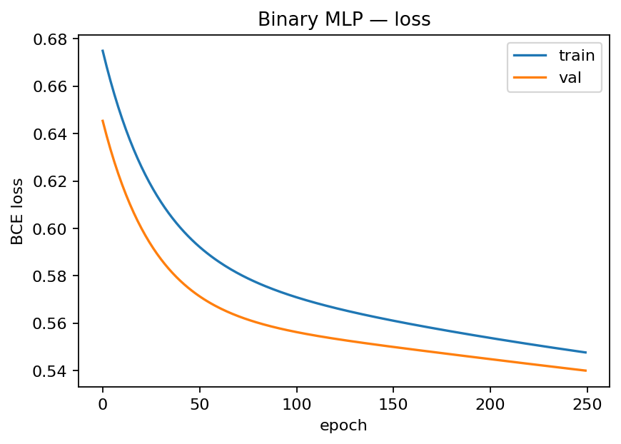
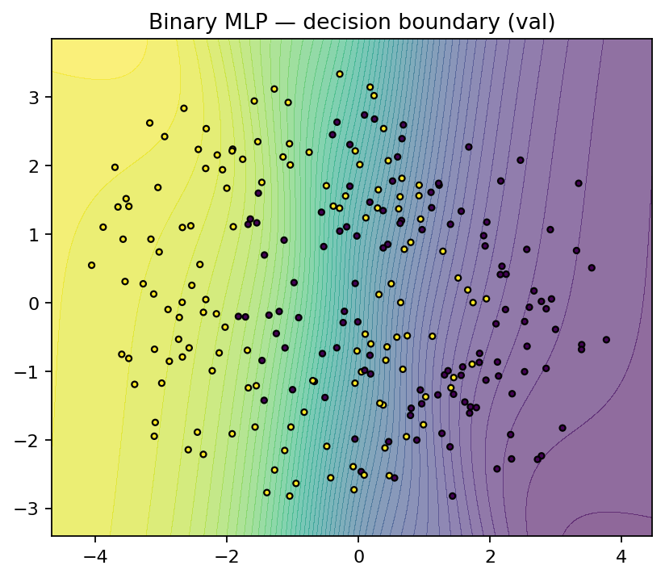
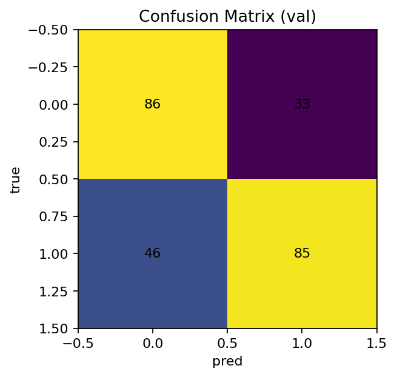
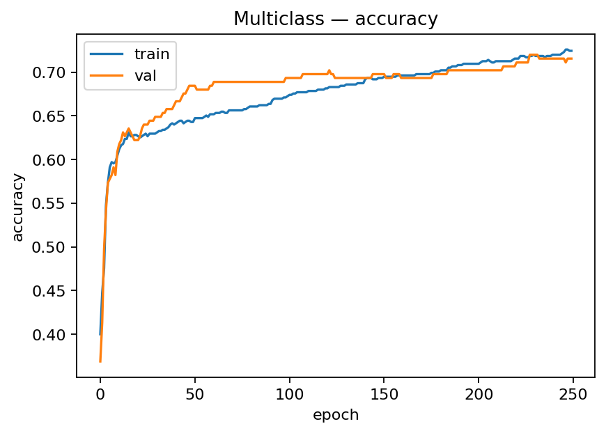
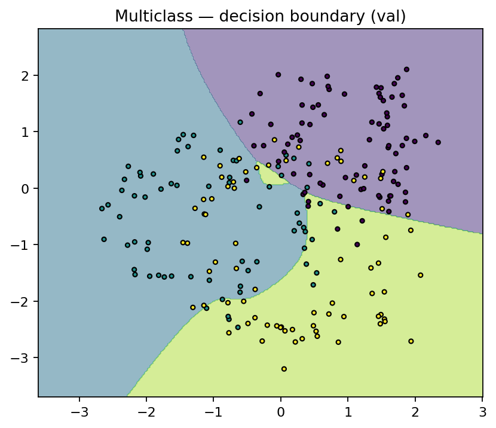
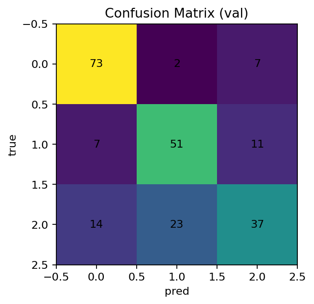
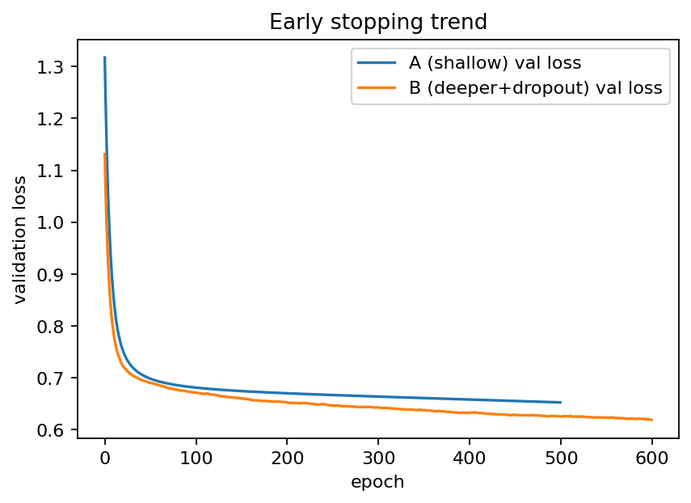
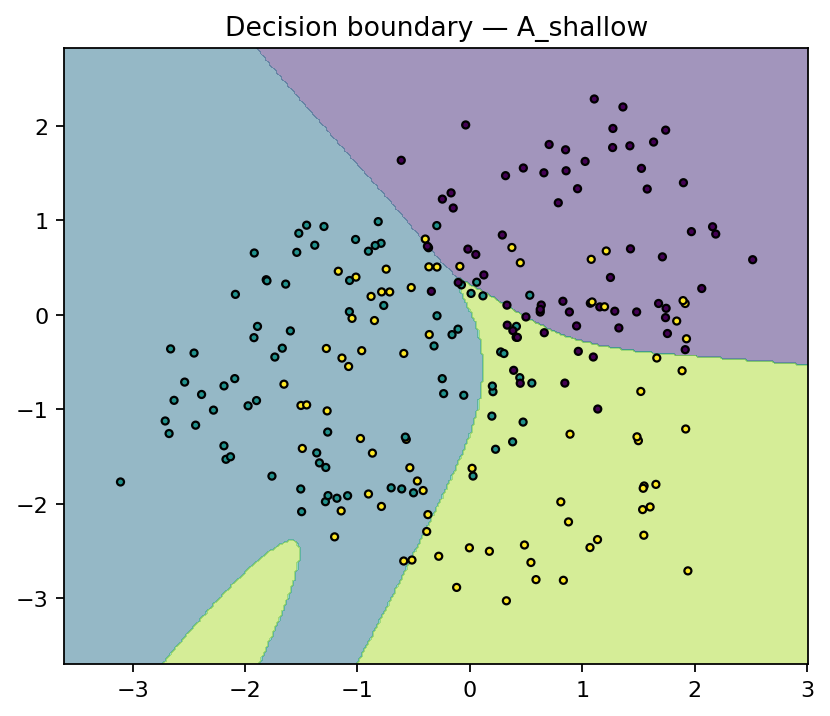
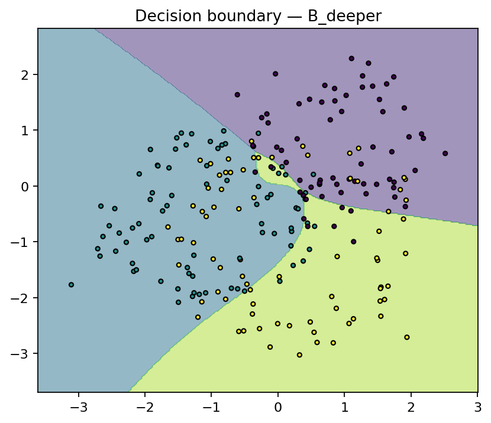

# MLP Implementation

## 1. Introduction

This report implements and analyzes four exercises on **Multi-Layer Perceptrons (MLPs)** using only NumPy (for the “from-scratch” parts). We strictly follow the assignment constraints:

- Hidden activation: **tanh** (for all scratch MLPs).
- Exercise 1 output activation: **tanh** (as required by the prompt).
- Binary classifier (Ex. 2) output: **sigmoid** with **binary cross-entropy (BCE)**.
- Multiclass (Ex. 3–4) output: **softmax** with **cross-entropy (CE)**.
- Learning rate for training: **$\eta = 0.3$** (as requested).
- Reproducible synthetic datasets (2D) to visualize **decision boundaries**.

Rubric alignment:
- Clear math derivations (Ex. 1).
- Clean, commented code (Ex. 2–4).
- Required figures: learning curves (loss/accuracy), decision boundaries, confusion matrices, and early-stopping trend.
- Concise discussions with quantitative outcomes and error analysis.

---

# Exercise 1 — Manual Calculation of an MLP *(tanh, $\eta=0.3$)*

# Exercise 1 — Manual Calculation of a 1-Hidden-Layer MLP (tanh, $\eta=0.3$)

We manually compute a forward and backward pass (with parameter updates) for a tiny MLP:
- Hidden activation: **tanh**
- **Output activation: tanh**
- Loss: **Mean Squared Error (MSE)** with a **single sample** ($N=1$)
- Learning rate: **$\eta = 0.3$**

---

## Setup (given)

- Input  
  $\mathbf{x} = [\,0.5,\; -0.2\,]$

- Target  
  $y = 1.0$

- Parameters  
  $\displaystyle
  \mathbf{W}^{(1)} =
  \begin{bmatrix}
  0.3 & -0.1\\
  0.2 & \;\;0.4
  \end{bmatrix},\quad
  \mathbf{b}^{(1)} = [\,0.1,\; -0.2\,]$
  
  $\displaystyle
  \mathbf{W}^{(2)} =
  \begin{bmatrix}
  0.5\\
 -0.3
  \end{bmatrix},\quad
  b^{(2)} = 0.2$

- Activation and its derivative  
  $\displaystyle \tanh(u) \quad\text{and}\quad \frac{d}{du}\tanh(u) = 1-\tanh^2(u)$

- MSE loss (single example)  
  $\displaystyle L = (y - \hat y)^2$

---

## 1) Forward Pass

### (a) Hidden pre-activations

**Formula used:**  
For a fully connected layer,  
$\displaystyle \mathbf{z}^{(1)} = \mathbf{x}\,\mathbf{W}^{(1)} + \mathbf{b}^{(1)}.$

**Plugging the numbers:**

$$
\begin{aligned}
z^{(1)}_1 &= 0.5(0.3) + (-0.2)(0.2) + 0.1
= 0.15 - 0.04 + 0.10
= \boxed{0.210000},\\[4pt]
z^{(1)}_2 &= 0.5(-0.1) + (-0.2)(0.4) + (-0.2)
= -0.05 - 0.08 - 0.20
= \boxed{-0.330000}.
\end{aligned}
$$

So  
$\displaystyle \boxed{\mathbf{z}^{(1)} = [\,0.210000,\; -0.330000\,]}.$

---

### (b) Hidden activations

**Formula used:**  
$\displaystyle \mathbf{h}^{(1)} = \tanh(\mathbf{z}^{(1)}).$

**Plugging the numbers:**

$$
\boxed{\mathbf{h}^{(1)} = [\,\tanh(0.210000),\; \tanh(-0.330000)\,]
= [\,0.20696650,\; -0.31852078\,]}.
$$

---

### (c) Output pre-activation

**Formula used:**  
$\displaystyle u^{(2)} = \mathbf{h}^{(1)}\mathbf{W}^{(2)} + b^{(2)}.$

**Plugging the numbers:**

$$
u^{(2)} = (0.20696650)(0.5) + (-0.31852078)(-0.3) + 0.2
= 0.10348325 + 0.09555623 + 0.20000000
= \boxed{0.39903948}.
$$

---

### (d) Final output (tanh)

**Formula used:**  
$\displaystyle \hat y = \tanh\!\big(u^{(2)}\big).$

**Plugging the number:**

$$
\boxed{\hat y = \tanh(0.39903948) = 0.37912681}.
$$

---

## 2) Loss (MSE)

**Formula used (single example):**  
$\displaystyle L = (y - \hat y)^2.$

**Plugging the numbers:**

$$
\boxed{L = (1.0 - 0.37912681)^2 = 0.38548352}.
$$

---

## 3) Backward Pass (Gradients)

We apply the chain rule from the output to the input parameters.

### (a) Output node

**Formulas used:**

1. $\displaystyle \frac{\partial L}{\partial \hat y} = 2(\hat y - y)$  
2. $\displaystyle \frac{\partial \hat y}{\partial u^{(2)}} = 1 - \tanh^2(u^{(2)}) = 1 - \hat y^2$  
3. $\displaystyle \frac{\partial L}{\partial u^{(2)}} = \frac{\partial L}{\partial \hat y}\cdot \frac{\partial \hat y}{\partial u^{(2)}}$

**Plugging the numbers:**

$$
\frac{\partial L}{\partial \hat y} = 2(0.37912681 - 1.0) = \boxed{-1.24174638}
$$

$$
\frac{\partial \hat y}{\partial u^{(2)}} = 1 - (0.37912681)^2 = \boxed{0.85626286}
$$

$$
\frac{\partial L}{\partial u^{(2)}} = (-1.24174638)(0.85626286) = \boxed{-1.06326131}
$$

---

### (b) Output layer parameters $(\mathbf{W}^{(2)}, b^{(2)})$

**Formulas used (linear layer):**  
1. $\displaystyle \frac{\partial L}{\partial \mathbf{W}^{(2)}} = \mathbf{h}^{(1)\top}\frac{\partial L}{\partial u^{(2)}}$  
2. $\displaystyle \frac{\partial L}{\partial b^{(2)}} = \frac{\partial L}{\partial u^{(2)}}$

**Plugging the numbers:**

$$
\boxed{
\frac{\partial L}{\partial \mathbf{W}^{(2)}} =
\begin{bmatrix}
0.20696650\\[2pt]
-0.31852078
\end{bmatrix}
(-1.06326131)
=
\begin{bmatrix}
-0.22005947\\[2pt]
\;\;0.33867082
\end{bmatrix}
}
\qquad
\boxed{\frac{\partial L}{\partial b^{(2)}} = -1.06326131}
$$

---

### (c) Backprop to hidden

**Formulas used:**  
1. $\displaystyle \frac{\partial L}{\partial \mathbf{h}^{(1)}} = \frac{\partial L}{\partial u^{(2)}}\,\mathbf{W}^{(2)\top}$  
2. $\displaystyle \frac{\partial \mathbf{h}^{(1)}}{\partial \mathbf{z}^{(1)}} =
1 - \tanh^2(\mathbf{z}^{(1)})$  
3. Element-wise chain:  
   $\displaystyle \frac{\partial L}{\partial \mathbf{z}^{(1)}} =
   \left(\frac{\partial L}{\partial \mathbf{h}^{(1)}}\right)
   \odot
   \left(\frac{\partial \mathbf{h}^{(1)}}{\partial \mathbf{z}^{(1)}}\right)$

**Plugging the numbers:**

$$
\frac{\partial L}{\partial \mathbf{h}^{(1)}}
= (-1.06326131)\,[\,0.5,\;-0.3\,]
= \boxed{[\, -0.53163065,\;\;0.31897839\,]}
$$

$$
\frac{\partial \mathbf{h}^{(1)}}{\partial \mathbf{z}^{(1)}}
= 1 - [\,\tanh(0.210000)^2,\;\tanh(-0.330000)^2\,]
= \boxed{[\,0.95716487,\;0.89854451\,]}
$$

$$
\frac{\partial L}{\partial \mathbf{z}^{(1)}}
= [\, -0.53163065,\;\;0.31897839\,] \odot [\,0.95716487,\;0.89854451\,]
= \boxed{[\, -0.50885819,\;\;0.28661628\,]}
$$

---

### (d) Hidden layer parameters $(\mathbf{W}^{(1)}, \mathbf{b}^{(1)})$

**Formulas used (linear layer):**  
1. $\displaystyle \frac{\partial L}{\partial \mathbf{W}^{(1)}} = \mathbf{x}^\top \frac{\partial L}{\partial \mathbf{z}^{(1)}}$  
2. $\displaystyle \frac{\partial L}{\partial \mathbf{b}^{(1)}} = \frac{\partial L}{\partial \mathbf{z}^{(1)}}$ (sum over batch; here $N=1$)

**Plugging the numbers:**

$$
\boxed{
\frac{\partial L}{\partial \mathbf{W}^{(1)}} =
\begin{bmatrix}
0.5\\[2pt]
-0.2
\end{bmatrix}
\begin{bmatrix}
-0.50885819 & \;\;0.28661628
\end{bmatrix}
=
\begin{bmatrix}
-0.25442909 & \;\;0.14330814\\[2pt]
\;\;0.10177164 & -0.05732326
\end{bmatrix}
}
$$

$$
\boxed{
\frac{\partial L}{\partial \mathbf{b}^{(1)}} =
[\, -0.50885819,\;\; 0.28661628\,]
}
$$

---

## 4) Parameter Update (Gradient Descent, $\eta=0.3$)

**Update rule used (all parameters):**  
$\displaystyle \theta \leftarrow \theta - \eta \,\frac{\partial L}{\partial \theta}.$

### (a) Output layer

**Plugging the numbers:**

$$
\mathbf{W}^{(2)}_{\text{new}} =
\begin{bmatrix}
0.5\\[2pt]
-0.3
\end{bmatrix}
- 0.3
\begin{bmatrix}
-0.22005947\\[2pt]
\;\;0.33867082
\end{bmatrix}
=
\boxed{
\begin{bmatrix}
0.56601784\\[2pt]
-0.40160125
\end{bmatrix}}
$$

$$
b^{(2)}_{\text{new}} = 0.2 - 0.3(-1.06326131) = \boxed{0.51897839}
$$

---

### (b) Hidden layer

**Plugging the numbers:**

$$
\mathbf{W}^{(1)}_{\text{new}} =
\begin{bmatrix}
0.3 & -0.1\\[2pt]
0.2 & \;\;0.4
\end{bmatrix}
- 0.3
\begin{bmatrix}
-0.25442909 & \;\;0.14330814\\[2pt]
\;\;0.10177164 & -0.05732326
\end{bmatrix}
=
\boxed{
\begin{bmatrix}
0.37632873 & -0.14299244\\[2pt]
0.16946851 & \;\;0.41719698
\end{bmatrix}}
$$

$$
\mathbf{b}^{(1)}_{\text{new}} =
[\,0.1,\; -0.2\,] - 0.3[\, -0.50885819,\; 0.28661628\,]
= \boxed{[\,0.25265746,\; -0.28598488\,]}
$$

---

## 5) Flat Summary (no matrices)

- $W^{(2)} = [\,\mathbf{0.56601784},\; \mathbf{-0.40160125}\,]$  
- $b^{(2)} = \mathbf{0.51897839}$  
- $W^{(1)}_{11}=\mathbf{0.37632873}$, $W^{(1)}_{12}=\mathbf{-0.14299244}$,  
  $W^{(1)}_{21}=\mathbf{0.16946851}$, $W^{(1)}_{22}=\mathbf{0.41719698}$  
- $b^{(1)} = [\,\mathbf{0.25265746},\; \mathbf{-0.28598488}\,]$

---

## (Optional) Reproducibility — Minimal NumPy script

> Use **tanh output** + **MSE** + **$\eta=0.3$** to get the same numbers above.

```python
import numpy as np

# Given
x = np.array([[0.5, -0.2]])
t = np.array([[1.0]])

W1 = np.array([[0.3, -0.1],
               [0.2,  0.4]])
b1 = np.array([[0.1, -0.2]])

W2 = np.array([[ 0.5],
               [-0.3]])
b2 = np.array([[0.2]])

eta = 0.3

# Activations
tanh  = np.tanh
dtanh = lambda z: 1 - np.tanh(z)**2

# Forward (tanh output)
z1 = x @ W1 + b1
h1 = tanh(z1)
u2 = h1 @ W2 + b2
y  = tanh(u2)
L  = (t - y)**2    # MSE, N=1

# Backward
dL_dy  = 2*(y - t)
dy_du2 = dtanh(u2)
dL_du2 = dL_dy * dy_du2

dW2 = h1.T @ dL_du2
db2 = dL_du2

dh1 = dL_du2 @ W2.T
dz1 = dh1 * dtanh(z1)
dW1 = x.T @ dz1
db1 = dz1

# Update
W2_new = W2 - eta * dW2
b2_new = b2 - eta * db2
W1_new = W1 - eta * dW1
b1_new = b1 - eta * db1

print("W2_new:\n", W2_new)
print("b2_new:\n", b2_new)
print("W1_new:\n", W1_new)
print("b1_new:\n", b1_new)
```

# Exercise 2 — Binary Classification with Synthetic Data (Scratch MLP)

**Goal.** Train a **from-scratch** MLP on a 2-class 2D dataset; report **loss/accuracy curves**, **decision boundary**, and **confusion matrix**.

**Data.** Two overlapping blobs/rings in $\mathbb{R}^2$ (1,000 samples; 75% train / 25% val).

**Model.**
- Architecture: $2 \rightarrow H \rightarrow 1$ with $H=8$.
- Hidden activation: **tanh**; Output: **sigmoid**.
- Loss: **BCE**; regularization: small L2 ($10^{-4}$).
- Training: full-batch GD, **$\eta=0.3$**, **250 epochs**.

**Learning curves.**  


**Decision boundary (validation).**  


**Confusion matrix (validation).**  


**Outcomes & discussion.**
- BCE loss decreases smoothly on both train/val (no divergence), indicating stable optimization with $\eta=0.3$.
- The decision boundary is **nonlinear** (as expected with tanh), separating most points with a gentle transition band.
- Confusion matrix counts (example run):  
  $\begin{bmatrix} 86 & 33 \\ 46 & 85 \end{bmatrix}$
- Potential improvements: larger $H$, additional layer, tuned regularization, or data standardization.

---

# Exercise 3 — Multi-Class Classification with Reusable MLP

**Goal.** Build a reusable MLP class (arbitrary hidden layers), train on a **3-class** synthetic dataset, and report **loss/accuracy**, **decision boundary**, and **confusion matrix**.

**Data.** Three clusters (900 samples total), 75%/25% split.

**Model.**
- Architecture: $2 \rightarrow 16 \rightarrow 16 \rightarrow 3$.
- Hidden activation: **tanh**; Output: **softmax** with **cross-entropy**.
- Training: full-batch GD, **$\eta=0.3$**, **250 epochs**, L2 $10^{-4}$.

**Loss curve (train vs val).**  


**Accuracy curve (train vs val).**  


**Decision boundary (validation).**  


**Confusion matrix (validation).**  


**Outcomes & discussion.**
- CE loss decreases; val accuracy reaches **~0.72**.
- Decision regions are curved with a small ambiguous pocket at class intersections.
- Example CM: rows show most confusion on class 2; adding capacity or light dropout could help.

---

# Exercise 4 — Deeper MLP + Regularization & Early Stopping

**Goal.** Compare a **shallow** vs a **deeper** MLP on the same 3-class dataset. Use **dropout** and **early stopping** based on validation loss.

**Models.**
- **A (shallow):** $2 \rightarrow 16 \rightarrow 3$, tanh.  
- **B (deeper):** $2 \rightarrow 32 \rightarrow 32 \rightarrow 3$, tanh, **dropout $p=0.2$**.
- Optimizer: full-batch GD, **$\eta=0.3$**; L2 $10^{-4}$.  
- Early stopping: patience 25 (A) / 35 (B), restore best val loss.

**Early-stopping trend (validation loss).**  


**Decision boundary — A (shallow).**  


**Decision boundary — B (deeper+dropout).**  


**Outcomes & discussion.**
- **B** atinge menor val loss (≈0.62 vs ≈0.65) e fronteiras mais precisas na região de interseção.
- Dropout + early stopping reduzem overfitting mantendo expressividade.

---

