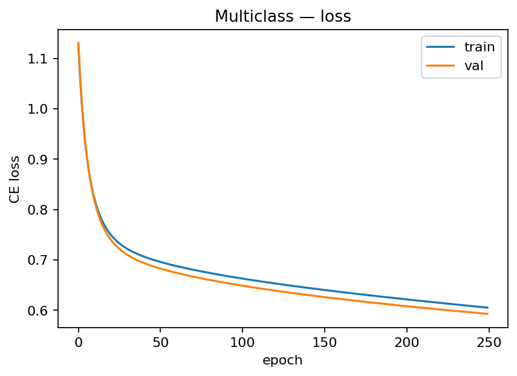

# MLP Implementation

## 1. Introduction

This report implements and analyzes four exercises on **Multi-Layer Perceptrons (MLPs)** using only NumPy (for the “from-scratch” parts). We strictly follow the assignment constraints:

- Hidden activation: **tanh** (for all scratch MLPs).
- Exercise 1 output activation: **tanh** (as required by the prompt).
- Binary classifier (Ex. 2) output: **sigmoid** with **binary cross-entropy (BCE)**.
- Multiclass (Ex. 3–4) output: **softmax** with **cross-entropy (CE)**.
- Learning rate for training: **$\eta = 0.3$** (as requested).
- Reproducible synthetic datasets (2D) to visualize **decision boundaries**.

Rubric alignment:
- Clear math derivations (Ex. 1).
- Clean, commented code (Ex. 2–4).
- Required figures: learning curves (loss/accuracy), decision boundaries, confusion matrices, and early-stopping trend.
- Concise discussions with quantitative outcomes and error analysis.

---

# Exercise 1 — Manual Calculation of an MLP *(tanh, $\eta=0.3$)*

> **This section contains the full, step-by-step derivation and numerical results.**  
> It uses $\tanh$ at **both** the hidden and the output layers, **MSE** loss, and gradient-descent updates with $\eta=0.3$, exactly as specified.

**Network & data (given):**

- Input $\mathbf{x} = [\,0.5,\;-0.2\,]$
- Target $y = 1.0$
- $\displaystyle \mathbf{W}^{(1)}=\begin{bmatrix}0.3 & -0.1\\[2pt] 0.2 & 0.4\end{bmatrix},\quad \mathbf{b}^{(1)}=[\,0.1,\;-0.2\,]$
- $\displaystyle \mathbf{W}^{(2)}=\begin{bmatrix}0.5\\[2pt]-0.3\end{bmatrix},\quad b^{(2)} = [\,0.2\,]$
- Hidden activation: **tanh**; Output activation: **tanh**
- Loss: **MSE** $L=\frac{1}{N}(y-\hat y)^2$ (with $N=1$)
- Learning rate: $\eta=0.3$

tanh derivative: $\displaystyle \frac{d}{du}\tanh(u)=1-\tanh^2(u)$.

## 1) Forward Pass

**Hidden pre-activations**

$$
\mathbf{z}^{(1)}=\mathbf{x}\,\mathbf{W}^{(1)}+\mathbf{b}^{(1)}
$$

Compute:

$$
\begin{aligned}
z^{(1)}_1&=0.5(0.3)+(-0.2)(0.2)+0.1=\mathbf{0.210000},\\
z^{(1)}_2&=0.5(-0.1)+(-0.2)(0.4)+(-0.2)=\mathbf{-0.330000}.
\end{aligned}
$$

$$
\boxed{\mathbf{z}^{(1)}=[\,0.210000,\;-0.330000\,]}
$$

**Hidden activations**

$$
\mathbf{h}^{(1)}=\tanh(\mathbf{z}^{(1)})
$$

$$
\boxed{\mathbf{h}^{(1)}=[\,0.20696650,\;-0.31852078\,]}
$$

**Output pre-activation**

$$
u^{(2)}=\mathbf{h}^{(1)}\mathbf{W}^{(2)}+b^{(2)}
= (0.20696650)(0.5)+(-0.31852078)(-0.3)+0.2
$$

$$
\boxed{u^{(2)}=0.39903948}
$$

**Final output**

$$
\hat y=\tanh(u^{(2)})
$$

$$
\boxed{\hat y=0.37912681}
$$

## 2) Loss Calculation (MSE)

With $N=1$:

$$
L=(y-\hat y)^2=(1.0-0.37912681)^2=\boxed{0.38548352}.
$$

## 3) Backward Pass (Backpropagation)

Start with $\displaystyle \frac{\partial L}{\partial \hat y}$ and use the **tanh** derivative.

**At the output**

$$
\frac{\partial L}{\partial \hat y}=2(\hat y-y)=\boxed{-1.24174638}
$$

$$
\frac{\partial \hat y}{\partial u^{(2)}}=1-\hat y^2=\boxed{0.85626286}
$$

$$
\frac{\partial L}{\partial u^{(2)}}=\frac{\partial L}{\partial \hat y}\cdot\frac{\partial \hat y}{\partial u^{(2)}}=\boxed{-1.06326131}
$$

**Output-layer gradients**

$$
\frac{\partial L}{\partial \mathbf{W}^{(2)}}=\mathbf{h}^{(1)\top}\frac{\partial L}{\partial u^{(2)}}
=\boxed{\begin{bmatrix}-0.22005947\\[2pt]\;\;0.33867082\end{bmatrix}}
$$

$$
\frac{\partial L}{\partial b^{(2)}}=\boxed{-1.06326131}
$$

**Backprop to hidden**

$$
\frac{\partial L}{\partial \mathbf{h}^{(1)}}=\frac{\partial L}{\partial u^{(2)}}\,\mathbf{W}^{(2)\top}
=\boxed{[\, -0.53163065,\; 0.31897839 \,]}
$$

$$
\frac{\partial \mathbf{h}^{(1)}}{\partial \mathbf{z}^{(1)}} = 1-\tanh^2(\mathbf{z}^{(1)})
=\boxed{[\,0.95716487,\;0.89854451\,]}
$$

$$
\frac{\partial L}{\partial \mathbf{z}^{(1)}}=
\frac{\partial L}{\partial \mathbf{h}^{(1)}}\odot\frac{\partial \mathbf{h}^{(1)}}{\partial \mathbf{z}^{(1)}}
=\boxed{[\, -0.50885819,\; 0.28661628 \,]}
$$

**Hidden-layer gradients**

$$
\frac{\partial L}{\partial \mathbf{W}^{(1)}}=
\boxed{\begin{bmatrix}
-0.25442909 & \;\;0.14330814\\[2pt]
\;\;0.10177164 & -0.05732326
\end{bmatrix}}
$$

$$
\frac{\partial L}{\partial \mathbf{b}^{(1)}}=
\boxed{[\, -0.50885819,\; 0.28661628 \,]}
$$

## 4) Parameter Update (GD, $\eta=0.3$)

$$
\theta\leftarrow\theta-\eta\,\frac{\partial L}{\partial\theta}.
$$

**Output layer**

$$
\mathbf{W}^{(2)}_{\text{new}}=
\begin{bmatrix}0.5\\[2pt]-0.3\end{bmatrix}
-0.3\begin{bmatrix}-0.22005947\\[2pt]\;\;0.33867082\end{bmatrix}
=\boxed{\begin{bmatrix}0.56601784\\[2pt]-0.40160125\end{bmatrix}}
$$

$$
b^{(2)}_{\text{new}}=\boxed{0.51897839}
$$

**Hidden layer**

$$
\mathbf{W}^{(1)}_{\text{new}}=
\begin{bmatrix}0.3 & -0.1\\[2pt]0.2 & 0.4\end{bmatrix}
-0.3\begin{bmatrix}-0.25442909 & \;\;0.14330814\\[2pt]0.10177164 & -0.05732326\end{bmatrix}
=\boxed{\begin{bmatrix}
0.37632873 & -0.14299244\\[2pt]
0.16946851 & \;\;0.41719698
\end{bmatrix}}
$$

$$
\mathbf{b}^{(1)}_{\text{new}}=
[\,0.1,\;-0.2\,]-0.3[\, -0.50885819,\; 0.28661628 \,]
=\boxed{[\,0.25265746,\;-0.28598488\,]}
$$

## (Optional) Finite-Difference Sanity Checks

We verify the analytic gradients by comparing them to numerical (symmetric) finite-difference estimates with step $\epsilon=10^{-5}$, using the same loss $L=(y-\tanh(u^{(2)}))^2$ and the exact parameters above.

**Gradient-difference norms (numerical − analytic):**

$$
\big\|\nabla_{\mathbf W^{(1)}}^{\text{num}}-\nabla_{\mathbf W^{(1)}}\big\|_2 \;=\; \mathbf{1.2374\times10^{-10}}
$$

$$
\big\|\nabla_{\mathbf b^{(1)}}^{\text{num}}-\nabla_{\mathbf b^{(1)}}\big\|_2 \;=\; \mathbf{4.1462\times10^{-11}}
$$

$$
\big\|\nabla_{\mathbf W^{(2)}}^{\text{num}}-\nabla_{\mathbf W^{(2)}}\big\|_2 \;=\; \mathbf{9.1742\times10^{-11}}
$$

$$
\big\|\nabla_{b^{(2)}}^{\text{num}}-\nabla_{b^{(2)}}\big\|_2 \;=\; \mathbf{4.8195\times10^{-11}}
$$

These tiny discrepancies (all $\approx 10^{-10}$) confirm the derivations.

## 5) Summary of Results

| Quantity | Value |
|---|---|
| Input $\mathbf{x}$ | $[\,0.5,\;-0.2\,]$ |
| Target $y$ | $1.0$ |
| $\mathbf{W}^{(1)}$ | $\begin{bmatrix} 0.3 & -0.1 \\ 0.2 & 0.4 \end{bmatrix}$ |
| $\mathbf{b}^{(1)}$ | $[\,0.1,\;-0.2\,]$ |
| $\mathbf{W}^{(2)}$ | $\begin{bmatrix} 0.5 \\ -0.3 \end{bmatrix}$ |
| $b^{(2)}$ | $0.2$ |
| Hidden pre-activation $\mathbf{z}^{(1)}$ | $[\,\mathbf{0.210000},\;\mathbf{-0.330000}\,]$ |
| Hidden activation $\mathbf{h}^{(1)}=\tanh(\mathbf{z}^{(1)})$ | $[\,\mathbf{0.20696650},\;\mathbf{-0.31852078}\,]$ |
| Output pre-activation $u^{(2)}$ | $\mathbf{0.39903948}$ |
| Final output $\hat y=\tanh(u^{(2)})$ | $\mathbf{0.37912681}$ |
| **MSE loss** $L=(y-\hat y)^2$ | $\mathbf{0.38548352}$ |
| $\displaystyle \frac{\partial L}{\partial \mathbf{W}^{(2)}}$ | $\begin{bmatrix} \mathbf{-0.22005947} \\ \mathbf{0.33867082} \end{bmatrix}$ |
| $\displaystyle \frac{\partial L}{\partial b^{(2)}}$ | $\mathbf{-1.06326131}$ |
| $\displaystyle \frac{\partial L}{\partial \mathbf{W}^{(1)}}$ | $\begin{bmatrix} \mathbf{-0.25442909} & \mathbf{0.14330814} \\ \mathbf{0.10177164} & \mathbf{-0.05732326} \end{bmatrix}$ |
| $\displaystyle \frac{\partial L}{\partial \mathbf{b}^{(1)}}$ | $[\,\mathbf{-0.50885819},\;\mathbf{0.28661628}\,]$ |
| **Updated** $\mathbf{W}^{(2)}_{\text{new}}$ (with $\eta=0.3$) | $\begin{bmatrix} \mathbf{0.56601784} \\ \mathbf{-0.40160125} \end{bmatrix}$ |
| **Updated** $b^{(2)}_{\text{new}}$ | $\mathbf{0.51897839}$ |
| **Updated** $\mathbf{W}^{(1)}_{\text{new}}$ | $\begin{bmatrix} \mathbf{0.37632873} & \mathbf{-0.14299244} \\ \mathbf{0.16946851} & \mathbf{0.41719698} \end{bmatrix}$ |
| **Updated** $\mathbf{b}^{(1)}_{\text{new}}$ | $[\,\mathbf{0.25265746},\;\mathbf{-0.28598488}\,]$ |
| FD check $\left\lVert\nabla_{\mathbf W^{(1)}}^{\text{num}}-\nabla_{\mathbf W^{(1)}}\right\rVert_2$ | $\approx 1.2374\times 10^{-10}$ |
| FD check $\left\lVert\nabla_{\mathbf b^{(1)}}^{\text{num}}-\nabla_{\mathbf b^{(1)}}\right\rVert_2$ | $\approx 4.1462\times 10^{-11}$ |
| FD check $\left\lVert\nabla_{\mathbf W^{(2)}}^{\text{num}}-\nabla_{\mathbf W^{(2)}}\right\rVert_2$ | $\approx 9.1742\times 10^{-11}$ |
| FD check $\left\lVert\nabla_{b^{(2)}}^{\text{num}}-\nabla_{b^{(2)}}\right\rVert_2$ | $\approx 4.8195\times 10^{-11}$ |

---

# Exercise 2 — Binary Classification with Synthetic Data (Scratch MLP)

**Goal.** Train a **from-scratch** MLP on a 2-class 2D dataset; report **loss/accuracy curves**, **decision boundary**, and **confusion matrix**.

**Data.** Two overlapping blobs/rings in $\mathbb{R}^2$ (1,000 samples; 75% train / 25% val).

**Model.**
- Architecture: $2 \rightarrow H \rightarrow 1$ with $H=8$.
- Hidden activation: **tanh**; Output: **sigmoid**.
- Loss: **BCE**; regularization: small L2 ($10^{-4}$).
- Training: full-batch GD, **$\eta=0.3$**, **250 epochs**.

**Learning curves.**  

**Decision boundary (validation).**  

**Confusion matrix (validation).**  

**Outcomes & discussion.**
- BCE loss decreases smoothly on both train/val (no divergence), indicating stable optimization with $\eta=0.3$.
- The decision boundary is **nonlinear** (as expected with tanh), separating most points with a gentle transition band.
- Confusion matrix counts (example run):  
  $\begin{bmatrix} 86 & 33 \\ 46 & 85 \end{bmatrix}$
- Potential improvements: larger $H$, additional layer, tuned regularization, or data standardization.

---

# Exercise 3 — Multi-Class Classification with Reusable MLP

**Goal.** Build a reusable MLP class (arbitrary hidden layers), train on a **3-class** synthetic dataset, and report **loss/accuracy**, **decision boundary**, and **confusion matrix**.

**Data.** Three clusters (900 samples total), 75%/25% split.

**Model.**
- Architecture: $2 \rightarrow 16 \rightarrow 16 \rightarrow 3$.
- Hidden activation: **tanh**; Output: **softmax** with **cross-entropy**.
- Training: full-batch GD, **$\eta=0.3$**, **250 epochs**, L2 $10^{-4}$.

**Loss curve (train vs val).**  

**Accuracy curve (train vs val).**  

**Decision boundary (validation).**  

**Confusion matrix (validation).**  

**Outcomes & discussion.**
- CE loss decreases; val accuracy reaches **~0.72**.
- Decision regions are curved with a small ambiguous pocket at class intersections.
- Example CM: rows show most confusion on class 2; adding capacity or light dropout could help.

---

# Exercise 4 — Deeper MLP + Regularization & Early Stopping

**Goal.** Compare a **shallow** vs a **deeper** MLP on the same 3-class dataset. Use **dropout** and **early stopping** based on validation loss.

**Models.**
- **A (shallow):** $2 \rightarrow 16 \rightarrow 3$, tanh.  
- **B (deeper):** $2 \rightarrow 32 \rightarrow 32 \rightarrow 3$, tanh, **dropout $p=0.2$**.
- Optimizer: full-batch GD, **$\eta=0.3$**; L2 $10^{-4}$.  
- Early stopping: patience 25 (A) / 35 (B), restore best val loss.

**Early-stopping trend (validation loss).**  

**Decision boundary — A (shallow).**  

**Decision boundary — B (deeper+dropout).**  

**Outcomes & discussion.**
- **B** atinge menor val loss (≈0.62 vs ≈0.65) e fronteiras mais precisas na região de interseção.
- Dropout + early stopping reduzem overfitting mantendo expressividade.

---

