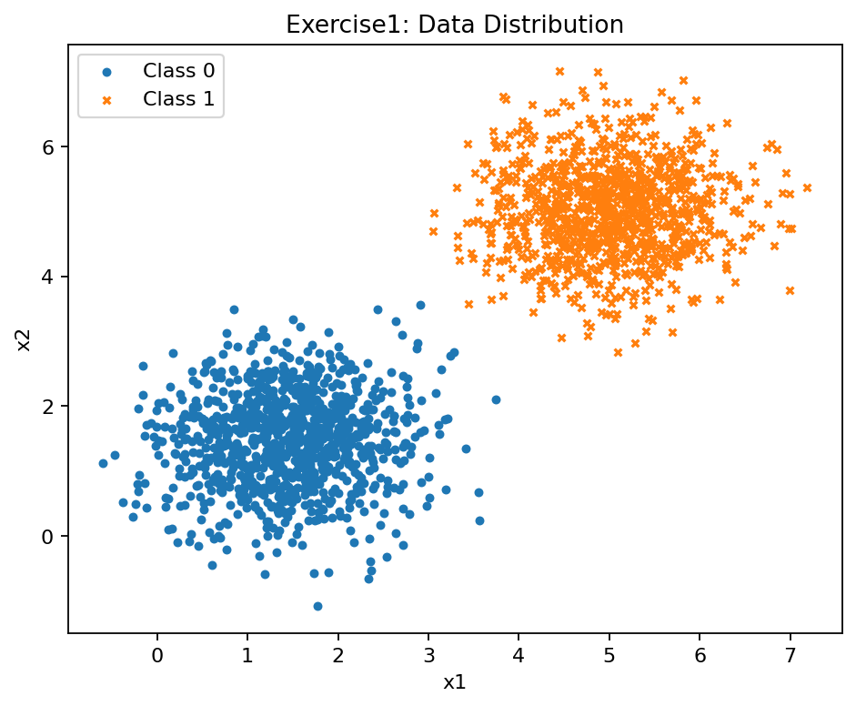
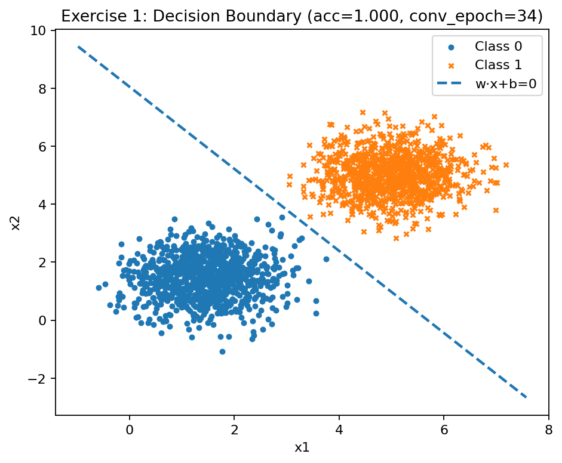
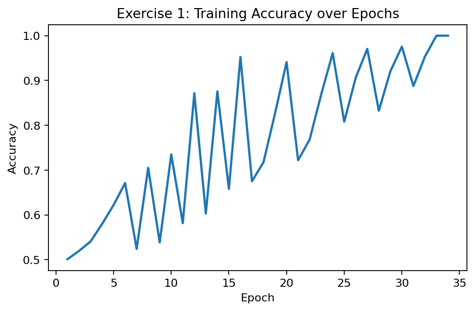
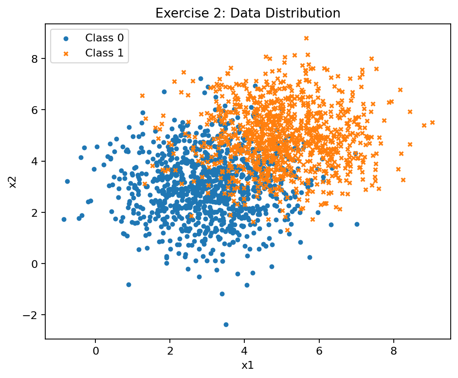
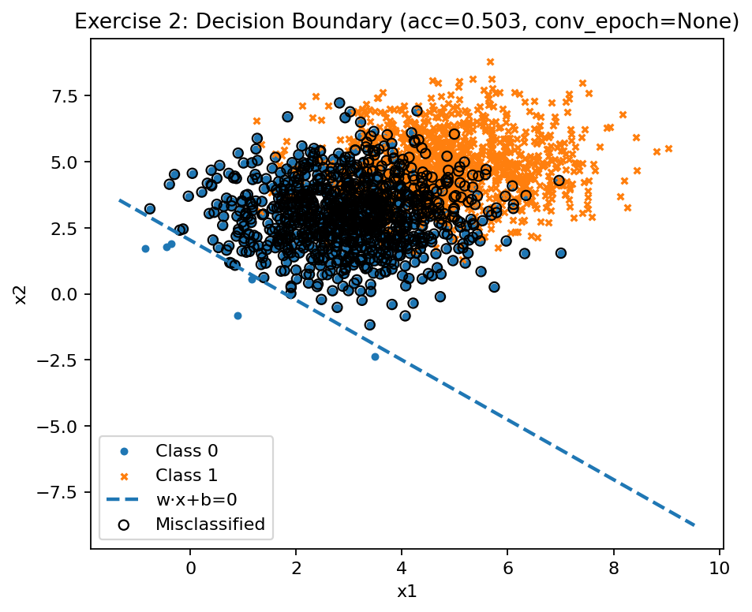
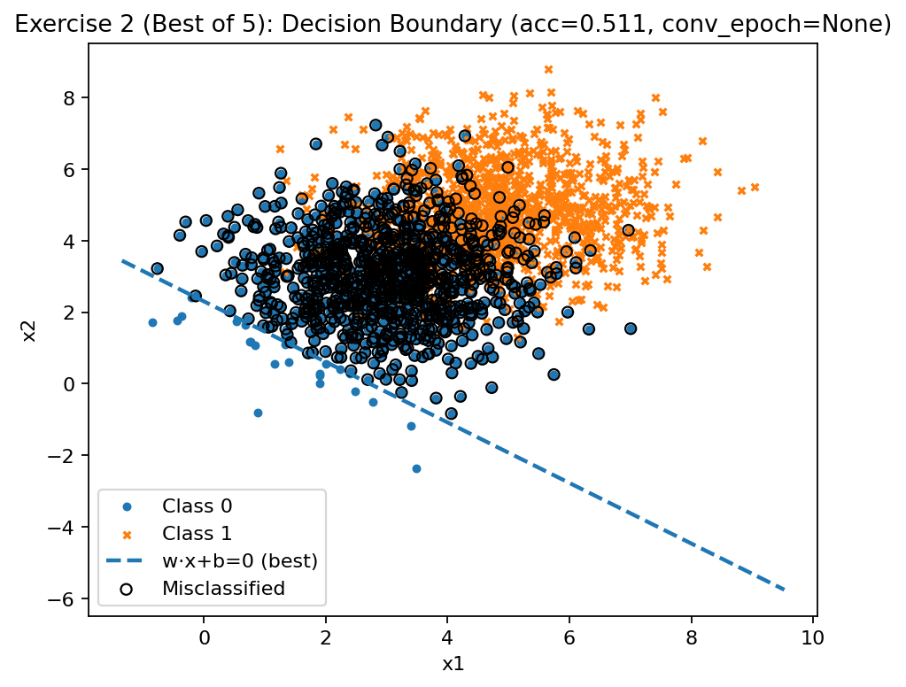
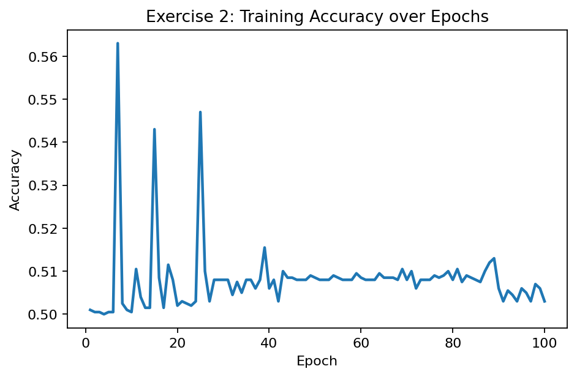
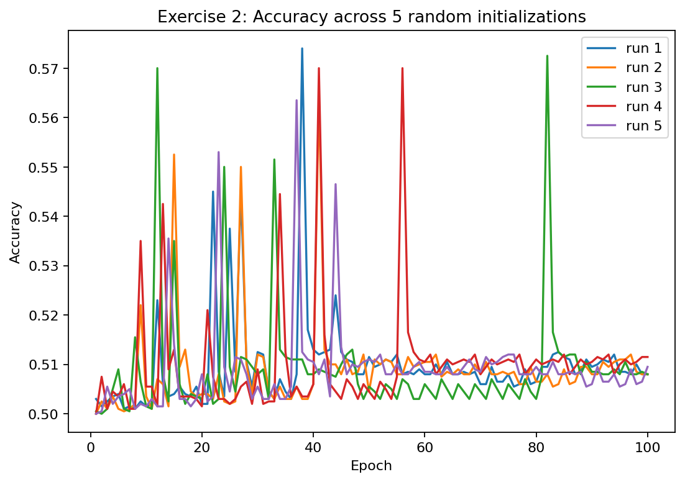

# Perceptron Implementation

## 1. Introduction

This report documents the full implementation of the **perceptron learning algorithm from scratch**, following the assignment requirements.  
The objectives are:

- Generate synthetic datasets using multivariate Gaussian distributions.  
- Implement the perceptron update rule using only **NumPy**.  
- Train and evaluate the model on **linearly separable** and **non-linearly separable** data.  
- Visualize the data distribution, decision boundaries, misclassified points, and accuracy curves.  
- Compare expected outcomes with actual results and discuss limitations.  

---

## 2. The Perceptron Model

The perceptron is a binary linear classifier. It learns a separating hyperplane of the form:

$$
f(\mathbf{x}) = \text{sign}(\mathbf{w}\cdot \mathbf{x} + b)
$$

where:

- $\mathbf{w}$ is the weight vector,  
- $b$ is the bias,  
- $\text{sign}(\cdot)$ determines the predicted class label.  

### Update Rule

If a sample $(\mathbf{x}, y)$, with $y \in \{-1, +1\}$, is **misclassified**, the perceptron parameters are updated as:

$$
\mathbf w \leftarrow \mathbf w + \eta \, y \, \mathbf x, 
\qquad
b \leftarrow b + \eta \, y
$$

- Learning rate: $\eta = 0.01$  
- Stopping criteria:  
  - stop early if an epoch has **zero mistakes**,  
  - or after a maximum of **100 epochs**.  

This iterative process is known as the **online perceptron algorithm**.

---

## 3. Exercise 1: Linearly Separable Data

### Assignment Description
We were asked to generate two Gaussian clusters that are **linearly separable** and train the perceptron to verify convergence.

- **Class 0**: mean = $[1.5, 1.5]$, covariance = $\begin{bmatrix}0.5 & 0 \\ 0 & 0.5\end{bmatrix}$  
- **Class 1**: mean = $[5, 5]$, covariance = $\begin{bmatrix}0.5 & 0 \\ 0 & 0.5\end{bmatrix}$  

### Our Approach
- Generated 2000 samples (1000 per class).  
- Mapped labels from $\{0,1\}$ to $\{-1,+1\}$ for perceptron training.  
- Initialized weights randomly and trained with the perceptron update rule.  
- Stopped training when no errors were found in an epoch.  

### Mathematical Expectation
Since the two Gaussian clusters are well separated, the dataset is **linearly separable**.  
Thus, the perceptron **must converge in finite steps**, according to the **Perceptron Convergence Theorem**.

### Results

**Data distribution:**

**Decision boundary (converged after 34 epochs):**

**Accuracy progression:**

### Analysis
- Convergence achieved after **34 epochs**.  
- Final accuracy = **100%**.  
- The model found a separating hyperplane consistent with the Perceptron Convergence Theorem.  

---

## 4. Exercise 2: Non-Linearly Separable Data

### Assignment Description
We were asked to generate two Gaussian clusters that **overlap** so that the dataset is not linearly separable.

- **Class 0**: mean = $[3, 3]$, covariance = $\begin{bmatrix}1.5 & 0 \\ 0 & 1.5\end{bmatrix}$  
- **Class 1**: mean = $[5, 5]$, covariance = $\begin{bmatrix}1.5 & 0 \\ 0 & 1.5\end{bmatrix}$  

### Our Approach
- Generated overlapping clusters (again 2000 samples).  
- Trained the perceptron with 5 different random initializations to test robustness.  
- Recorded accuracy progression and best run.  

### Mathematical Expectation
For **non-linearly separable data**, the perceptron **cannot converge** because no separating hyperplane exists.  
The model will continue to oscillate, and accuracy will remain close to **random guessing (~50%)**.

### Results

**Data distribution:**

**Decision boundary (example run):**

**Best of 5 runs:**

**Accuracy progression (example run):**

**Accuracy across multiple runs:**

### Analysis
- Accuracy fluctuated between **50–52%**, regardless of initialization.  
- Training never reached zero mistakes in an epoch.  
- Misclassified points remained even after 100 epochs.  
- Confirms theoretical limitation: perceptron cannot solve non-linearly separable problems.  

---

## 5. Conclusion

- **Exercise 1**: The perceptron converged perfectly, achieving **100% accuracy** with linearly separable data.  
- **Exercise 2**: With overlapping classes, the perceptron failed to converge, stabilizing near **50% accuracy**.  

This experiment demonstrates the **strength and limitation** of the perceptron:  
- It guarantees convergence on linearly separable data.  
- It fails on non-linearly separable datasets due to the lack of a perfect separating hyperplane.  

---

## 6. Evaluation Criteria Alignment

- **Correctness of implementation**: perceptron built from scratch with NumPy only.  
- **Exercise 1**: demonstrated convergence as predicted by theory.  
- **Exercise 2**: demonstrated failure to converge with overlapping clusters.  
- **Visualizations**: complete set of scatter plots, decision boundaries, accuracy curves.  
- **Mathematical explanation**: update rule, convergence theorem, and theoretical expectations included.  
- **Discussion**: results analyzed in depth and compared with theoretical expectations.  
