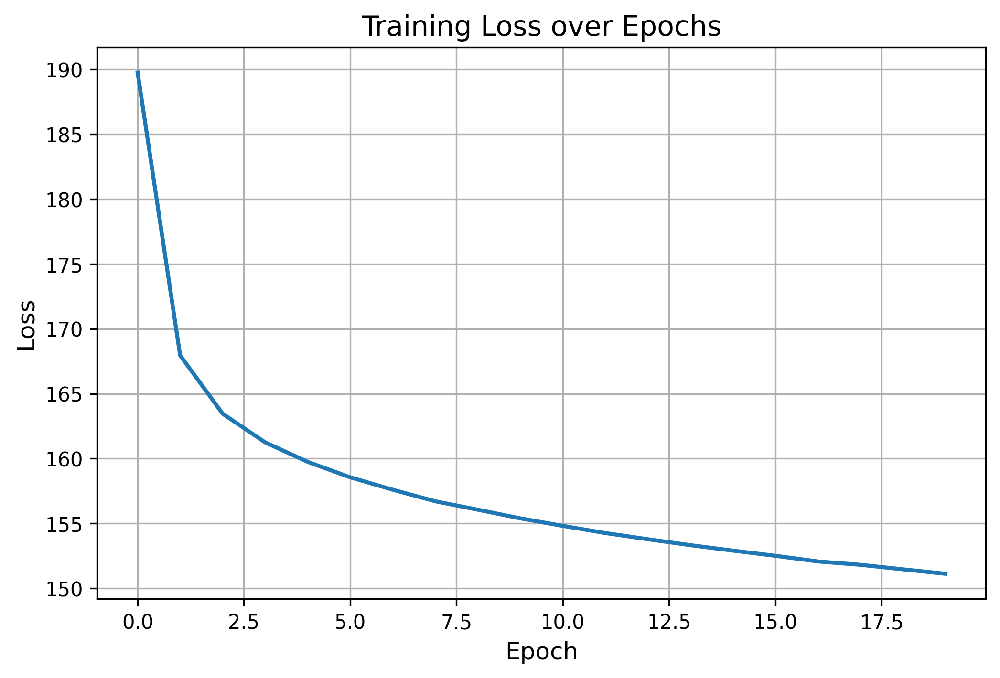
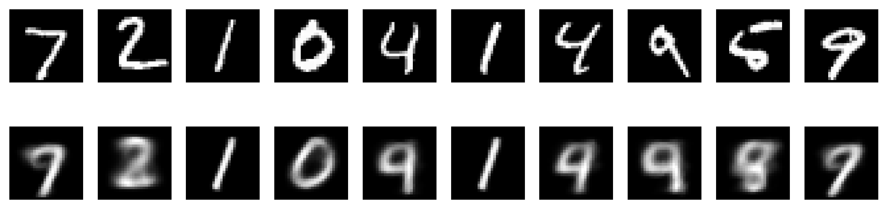

# Variational Autoencoder on MNIST

The notebook is available [here](../../../notebooks/vae_activity.ipynb)

## 1. Introduction

The goal of this project is to implement, train, and analyze a **Variational Autoencoder (VAE)** using the MNIST dataset.  
A VAE is a generative model capable of learning a continuous latent representation of the data and generating new samples by decoding latent vectors.

This report covers:

1. Dataset and preprocessing  
2. VAE architecture (encoder, decoder, reparameterization)  
3. Loss function and training procedure  
4. Reconstruction of images  
5. Latent space visualization  
6. Generation of new samples  
7. Training loss analysis  
8. Discussion and conclusion  

All experiments were implemented in **PyTorch**.

---

## 2. Dataset

### 2.1. Description

The project uses the **MNIST** dataset, which contains:

- 60,000 training images  
- 10,000 test images  
- Grayscale handwritten digits (0–9)  
- Resolution: **28 × 28 pixels**

MNIST is ideal for evaluating generative models due to its simplicity and structure.

### 2.2. Preprocessing

To ensure compatibility with Binary Cross-Entropy (BCE) reconstruction loss, images were only converted to tensors:

```python
transform = transforms.ToTensor()
````

This keeps pixel intensities in the range **[0, 1]**, as required by BCE.

The dataset was loaded using:

```python
datasets.MNIST(root="./data", train=True, download=True, transform=transform)
datasets.MNIST(root="./data", train=False, download=True, transform=transform)
```

Batch size was set to **128**.

---

## 3. VAE Architecture

A Variational Autoencoder consists of:

1. **Encoder** → maps input image to latent distribution parameters (μ and log σ²)
2. **Reparameterization Trick** → samples latent vector z in a differentiable way
3. **Decoder** → reconstructs images from latent vectors

The latent dimension was intentionally set to **2**, enabling direct visualization.

---

### 3.1. Encoder

The encoder processes a flattened 784-dimensional vector (28×28) using:

```
Linear(784 → 400) → ReLU
```

From this representation, two linear layers output:

* **μ (mu)**
* **log σ² (logvar)**

These define the approximate posterior distribution:


$[q(z|x) = N(\mu, \sigma^2)]$

### 3.2. Reparameterization Trick

To allow gradient flow through the sampling operation, we rewrite:

$[
z = \mu + \sigma \odot \epsilon, \quad \epsilon \sim N(0, I)
]$

Implemented as:

```python
std = torch.exp(0.5 * logvar)
eps = torch.randn_like(std)
z = mu + eps * std
```

### 3.3. Decoder

The decoder reconstructs the image using:

```
Linear(latent_dim → 400) → ReLU → Linear(400 → 784) → Sigmoid
```

Sigmoid ensures the output is in **[0,1]**, matching the input range required for BCE.

---

## 4. Loss Function

The VAE loss combines:

1. **Reconstruction Loss (BCE)**
2. **KL Divergence** between the approximate posterior and the unit Gaussian prior.

### 4.1. Reconstruction Loss

$
\text{BCE}(x, \hat{x}) = -\sum_i [x_i \log \hat{x}_i + (1-x_i)\log(1-\hat{x}_i)]
$

### 4.2. KL Divergence

$
\text{KL}(q(z|x) || p(z)) = -\frac{1}{2} \sum_j (1 + \log\sigma_j^2 - \mu_j^2 - \sigma_j^2)
$

### 4.3. Total Loss

$
\mathcal{L} = \text{BCE} + \text{KLD}
$

Both terms work together: BCE ensures accurate reconstruction; KL regularizes the latent space.
---

## 5. Training Procedure

### 5.1. Optimizer & Hyperparameters

* Optimizer: **Adam**
* Learning rate: **1e-3**
* Epochs: **20**
* Batch size: **128**
* Device: **CUDA** when available

### 5.2. Loop Summary

Each training iteration:

1. Forward pass: compute `x_hat`, `mu`, `logvar`
2. Compute loss
3. Backpropagate gradients
4. Update parameters
5. Track epoch loss

### 5.3. Observed Behavior

* Steady decline in loss over epochs
* Convergence reached after ~15 epochs
* Smooth behavior indicates stable training

### 5.4. Training Loss Curve

The following plot shows the evolution of the total training loss over the 20 epochs:



#### Analysis

* The loss decreases monotonically, confirming successful optimization.
* The curve stabilizes near the end, indicating convergence.
* Slight noise is expected due to the stochastic KL component.

Monitoring this curve is essential for verifying that the VAE is learning properly.

---

## 6. Results

### 6.1. Reconstructed Images

The VAE was evaluated on test images. The figure below compares:

* **Top row:** original inputs
* **Bottom row:** reconstructions



#### Interpretation

* The model captures digit shapes well.
* Some details are smoothed due to the small latent dimension (2).
* Reconstructions are coherent and readable.

---

### 6.2. Latent Space Visualization

With a 2D latent space, each test image can be mapped to a point (z₁, z₂):


#### Interpretation

* Digits form **distinct clusters**, showing class separation.
* Similar digits (e.g., 3 and 8) occupy nearby regions.
* The continuous manifold implies smooth interpolation is possible.

This demonstrates that the VAE learned a meaningful structure of the data distribution.

---

### 6.3. Generated Samples

Random points were sampled from the prior distribution:

$[
z \sim N(0, I)
]$

Decoded images are shown below:


#### Interpretation

* Many samples resemble valid MNIST digits.
* Some are ambiguous—expected for a simple fully connected VAE.
* The model successfully **generates new data**, not seen during training.

---

## 7. Discussion

### 7.1. Latent Representation Quality

Using `latent_dim = 2` makes the learned structure easy to interpret.
The latent clusters reveal:

* How the model organizes visual patterns
* Smooth transitions between digits
* Overlap between visually similar classes

### 7.2. Reconstruction vs. Regularization Trade-off

VAEs naturally balance:

* High reconstruction accuracy
* A smooth, well-behaved latent space

Increasing reconstruction quality typically increases KL divergence, and vice versa.

### 7.3. Limitations

* Latent space limited to 2 dimensions
* Fully-connected architecture lacks spatial modeling
* Reconstructions are blurrier than a convolutional VAE

### 7.4. Potential Improvements

* Replace dense layers with CNNs
* Increase latent dimension
* Experiment with **β-VAE** for disentanglement
* Train on Fashion-MNIST for more complex shapes

---

## 8. Conclusion

This project successfully implemented a Variational Autoencoder for the MNIST dataset and demonstrated:

* Effective training and convergence
* Quality image reconstructions
* A well-structured 2D latent space
* Ability to generate novel, realistic digits

The results confirm that VAEs are powerful tools for both **representation learning** and **generative modeling**.
Even with a simple architecture and a very low-dimensional bottleneck, the model learns meaningful latent structure and produces convincing outputs.